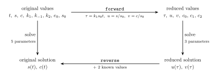

Recovering the original system from a numerical solution
========================================================

Reduction is only half of a workflow.  Having reduced a system, solved it, and fitted its
parameters, we usually want the answer back in the units we started in.  This page walks
through that round trip on the Michaelis-Menten equations: we solve the *reduced* system
numerically and recover the solution of the *original* one, then check the two agree.

The tools are in :mod:`desr.numerics`, which needs :mod:`numpy`.  It is not imported by
``desr`` itself, so nothing changes for users who only work symbolically.  This page also
uses :mod:`scipy` to do the integrating; :mod:`desr` never calls it.

The system and its reduction
----------------------------

We take the two-variable Michaelis-Menten system with an initial condition on :math:`s`.

.. math::
    :nowrap:

    \begin{align}
    \frac{ds}{dt} &= - k_1 e_0 s + k_1 c s + k_{-1} c \\
    \frac{dc}{dt} &= k_1 e_0 s - k_1 c s - k_{-1} c - k_2 c \\
    s(0) &= s_0.
    \end{align}

We build it in Python from its TeX, and add the initial condition.  The variable order
matters: the reduction normalises away the variables that come last.

    >>> import numpy as np
    >>> from scipy.integrate import solve_ivp
    >>> from desr.numerics import NumericTranslation

    >>> system_tex = '''\frac{ds}{dt} &= - k_1 e_0 s + k_1 c s + k_{-1} c \\\\
    ...          \frac{dc}{dt} &= k_1 e_0 s - k_1 c s - k_{-1} c - k_2 c'''
    >>> system = ODESystem.from_tex(system_tex)
    >>> system.update_initial_conditions({'s': 's_0'})
    >>> system.reorder_variables(['t', 's', 'c', 'k_m1', 'k_2', 'k_1', 'e_0', 's_0'])

Reduce it, naming the new variables :math:`\tau, u, v` and the new constants :math:`c_i`.

    >>> translation = ODETranslation.from_ode_system(system,
    ...                                              naming_scheme=('tau', ['u', 'v'], 'c'))
    >>> translation.invariants()
    Matrix([[k_1*s_0*t, s/s_0, c/s_0, k_m1/(k_1*s_0), k_2/(k_1*s_0), e_0/s_0]])
    >>> reduced = translation.translate(system)
    >>> reduced
    dtau/dtau = 1
    du/dtau = c0*v - c2*u + u*v
    dv/dtau = -c0*v - c1*v + c2*u - u*v
    dc0/dtau = 0
    dc1/dtau = 0
    dc2/dtau = 0
    u(0) = 1

Five constants have become three.  The two that vanished are the two scaling symmetries of
the system:

    >>> translation.r
    2

Give the variables names we can use below.

    >>> t, s, c, k_m1, k_2, k_1, e_0, s_0 = system.variables
    >>> tau, u, v, c0, c1, c2 = reduced.variables

Solving the original system, for comparison
-------------------------------------------

Choose parameter values and solve directly.  This is the answer we want to recover.

    >>> parameters = {k_1: 1.5, k_m1: 0.9, k_2: 0.4, e_0: 0.3, s_0: 2.0}
    >>> def as_function(a_system, constants):
    ...     variables = list(a_system.non_constant_variables)
    ...     rhs = [a_system.derivative_dict[x].subs(constants) for x in variables]
    ...     return sympy.lambdify([a_system.indep_var, variables], rhs, modules='numpy')

    >>> times = np.linspace(0.0, 8.0, 9)
    >>> reference = solve_ivp(as_function(system, parameters), (0.0, 8.0), [2.0, 0.0],
    ...                       t_eval=times, rtol=1e-10, atol=1e-12)

Translating the numbers into the reduced system
-----------------------------------------------

:class:`~desr.numerics.NumericTranslation` carries numbers across the same reduction that
:class:`~desr.ode_translation.ODETranslation` applies to symbols.

    >>> numeric = NumericTranslation(system, translation, reduced)

:meth:`~desr.numerics.NumericTranslation.forward` takes values of the original variables and
returns values of the reduced ones.  Here it converts the starting state and the parameters.

    >>> start = numeric.forward({t: 0.0, s: 2.0, c: 0.0, **parameters})
    >>> [float(start[x]) for x in (tau, u, v)]
    [0.0, 1.0, 0.0]
    >>> [float(start[x]) for x in (c0, c1, c2)]
    [0.3, 0.13333333333333333, 0.15]

A partial dictionary is enough: anything the given values determine comes back.  Passing
only the parameters and a time converts the time axis, since :math:`\tau = k_1 s_0 t`.

    >>> reduced_times = numeric.forward({t: times, **parameters})[tau]
    >>> [float(x) for x in reduced_times[:3]]
    [0.0, 3.0, 6.0]

Now solve the reduced system.

    >>> reduced_parameters = {c0: start[c0], c1: start[c1], c2: start[c2]}
    >>> solution = solve_ivp(as_function(reduced, reduced_parameters),
    ...                      (reduced_times[0], reduced_times[-1]),
    ...                      [float(start[u]), float(start[v])],
    ...                      t_eval=reduced_times, rtol=1e-10, atol=1e-12)

Solving then reducing, or reducing then solving
-----------------------------------------------

Before going back, it is worth checking the two routes agree.  There are two ways to get
from the original system to its solution, and they should give the same answer.

Going right-then-down is what we just did: reduce, then solve.  Going down-then-right is the
other route: solve the original system, then translate its solution.  We have the original
solution already, in ``reference``.  Since the invariants are :math:`\tau = k_1 s_0 t`,
:math:`u = s / s_0` and :math:`v = c / s_0`, translating it is exactly what
:meth:`~desr.numerics.NumericTranslation.forward` does -- and it takes the whole trajectory
in a single call.

    >>> translated = numeric.forward({t: times, s: reference.y[0], c: reference.y[1],
    ...                               **parameters})

The reduced solution we computed above and the translated original solution are the same
curve, on the same time axis.

    >>> bool(np.max(np.abs(translated[tau] - solution.t)) < 1e-10)
    True
    >>> bool(np.max(np.abs(translated[u] - solution.y[0])) < 1e-8)
    True
    >>> bool(np.max(np.abs(translated[v] - solution.y[1])) < 1e-8)
    True

So the square commutes: reducing and solving may be done in either order.  That is the
property that makes the reduced system worth solving at all, and it is why the round trip
below is exact rather than merely close -- the only error anywhere is the integrator's.

Translating back: what you have to know
---------------------------------------

The reduced system cannot tell us which original system it came from.  It is shared by an
entire two-parameter family of them, all of which fit equally well.  So
:meth:`~desr.numerics.NumericTranslation.reverse` asks for
:attr:`~desr.numerics.NumericTranslation.r` values that you already know -- here the rate
:math:`k_1` and the initial substrate :math:`s_0`, both of which an experimenter would have.

Values may be arrays, so the whole time series converts in one call.

    >>> series = {tau: solution.t, u: solution.y[0], v: solution.y[1],
    ...           c0: start[c0], c1: start[c1], c2: start[c2]}
    >>> recovered = numeric.reverse(series, known_values={k_1: 1.5, s_0: 2.0})

The independent variable comes back as the original :math:`t`.

    >>> bool(np.max(np.abs(recovered[t] - times)) < 1e-10)
    True

And the trajectories agree with the direct solve.

    >>> bool(np.max(np.abs(recovered[s] - reference.y[0])) < 1e-8)
    True
    >>> bool(np.max(np.abs(recovered[c] - reference.y[1])) < 1e-8)
    True

The constants come back too, which is what a fitting workflow is really after: fit
:math:`c_0, c_1, c_2` in the reduced system, then read off the original rates.

    >>> [round(float(recovered[x]), 10) for x in (k_m1, k_2, e_0)]
    [0.9, 0.4, 0.3]

The whole workflow, drawn
-------------------------

``examples/michaelis_menten_numeric.py`` runs everything on this page end to end and draws
the result.  The reduced system on the left and the original on the right are the same
curves on rescaled axes, which is what the commuting square above says they must be.  The
circles are the recovered solution sitting on the directly computed one.

.. plot:: ../../examples/michaelis_menten_numeric.py

The right-hand panel is the one worth dwelling on.  The disagreement between the two routes
never exceeds :math:`10^{-11}`, two orders of magnitude below the tolerance the integrator
was asked for.  Translating back is an exact operation on the numbers -- each original
variable is a product of integer powers of the reduced ones -- so it introduces no error of
its own, and what is plotted there is the solver's noise and nothing else.

Supplying too little
--------------------

Asking for the original system without enough information is an error, not a guess.

    >>> numeric.reverse(series, known_values={k_1: 1.5})
    Traceback (most recent call last):
        ...
    desr.numerics.InsufficientKnownValues: Need 2 known values of the original system, but 1 (k_1) was supplied.
    The reduced system is shared by an entire 2-parameter family of original systems, so this is not enough to choose between them.
    Supply values for 2 of: s, c, k_m1, k_2, k_1, e_0, s_0.

Two values are not always enough either.  Knowing :math:`k_{-1}` and :math:`k_2` tells us
only about :math:`c_0` and :math:`c_1`, which between them pin down the single combination
:math:`k_1 s_0` rather than both factors.

    >>> numeric.reverse(series, known_values={k_m1: 0.9, k_2: 0.4})
    Traceback (most recent call last):
        ...
    desr.numerics.InsufficientKnownValues: The 2 known values supplied (k_m1, k_2) do not determine the original system: they overlap, and leave some of it free.
    The reduced system is shared by an entire 2-parameter family of original systems, so this is not enough to choose between them.
    Supply values for 2 of: s, c, k_m1, k_2, k_1, e_0, s_0.

This is not a shortcoming of the reverse translation.  It is the reduction doing its job:
those two directions in parameter space genuinely do not affect the solution, which is why
removing them makes the remaining parameters easier to fit.
